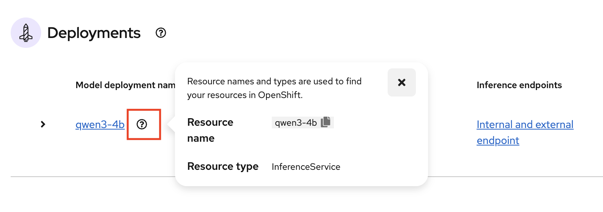
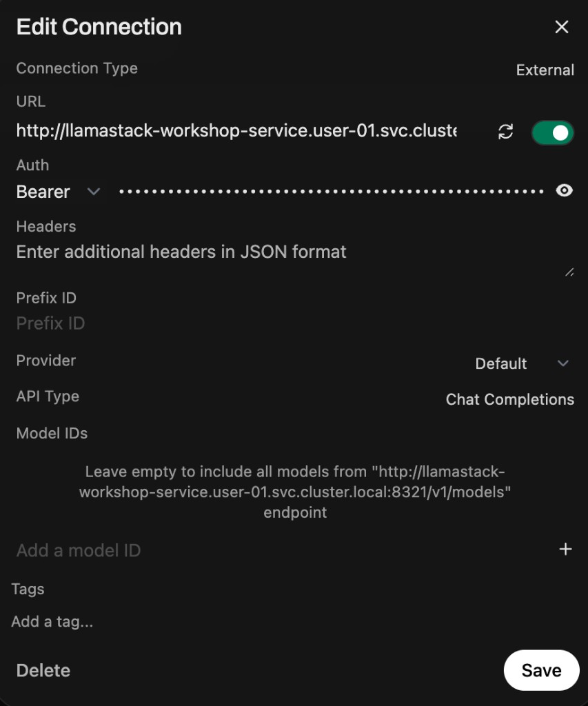

# Red Hat OpenShift AI — Model Deployment Workshop

> A hands-on guide for deploying AI models on Red Hat OpenShift AI (RHOAI) 3.4, enabling tool calling with vLLM, deploying Open WebUI as a full-featured chat interface, and testing RAG — with a live instructor demo of MCP tool calling via the AI Playground.

**Total time:** ~2 hours

---

## What You'll Learn

By the end of this workshop, you will:

- Create a Data Science project in OpenShift AI
- Deploy an AI model (Qwen3-4B) with tool calling enabled using the vLLM runtime
- Deploy Open WebUI as a self-hosted chat interface with RAG support
- Connect Open WebUI directly to your vLLM model endpoint
- Test LLM chat and document-based RAG
- See a live demo of MCP tool calling against cluster resources via the AI Playground
- Understand hardware profiles, model serving, and agentic AI concepts

### Workshop Structure

| Part | Title | Type | Duration |
|------|-------|------|----------|
| Part 1 | Access OpenShift AI | Hands-on | ~5 min |
| Part 2 | Create Your Project | Hands-on | ~5 min |
| Part 3 | Deploy a Model | Hands-on | ~15 min |
| Part 4 | Wait for Model & Monitor | Hands-on | ~10 min |
| Part 5 | Open Web Terminal, Clone Repo, Set Env Vars | Hands-on | ~5 min |
| Part 6 | Deploy Open WebUI | Hands-on | ~5 min |
| Part 7 | Connect Model to OpenWebUI | Hands-on | ~5 min |
| Part 8 | Test LLM Chat | Hands-on | ~10 min |
| Part 9 | Test RAG | Hands-on | ~10 min |
| Instructor Demo | MCP Tool Calling via AI Playground | Demo | ~15 min |
| Instructor Demo | Observe Tab Metrics | Demo | ~10 min |
| Appendix A | AI Playground (Optional) | Optional | -- |
| Appendix B | Model Catalog | Optional | -- |
| Appendix C | Instructor Setup Checklist | Reference | -- |

---

## Prerequisites

Before starting, make sure the following are ready:

- A running OpenShift 4.20+ cluster with RHOAI 3.4 installed
- At least one GPU node available in the cluster (e.g., NVIDIA L4, L40S, or A100)
- A GPU hardware profile created by your administrator (`gpu-profile`)
- Your login credentials (username and password provided by your instructor)

> **Instructor note:** Use `scripts/install-rhoai-34.sh --skip-rhcl --skip-maas --setup-users --num-users <N>` to create workshop user accounts. RHCL and MaaS are not required for this workshop. See the [RHOAI 3.4 Installation Guide](rhoai-3.4/RHOAI-34-INSTALLATION.md) for full setup details.

---

## Your User Number

Throughout this guide, you'll see `user-XX`. **Replace XX with your assigned number.**

For example, if you are **user 5**, then:

- `user-XX` becomes `user-05`
- Your project name is `user-05`

> Always use two digits: user 5 = `user-05`, user 12 = `user-12`

**Write your user number here:** `user-____`

---

# Part 1: Access OpenShift AI (~5 min)

## Step 1.1: Log into OpenShift AI

1. Open your web browser (Chrome or Firefox recommended)
2. Go to the **OpenShift AI Dashboard URL** provided by your instructor
3. You will be redirected to a login page — select the login provider specified by your instructor (e.g., `workshop-users` or `htpasswd`)
4. Enter your username and password
5. Click **"Log in"**

You should now see the **OpenShift AI Dashboard** with a left sidebar showing menu items like "Projects", "Model catalog", "Gen AI studio", etc.


> Can't log in? Double-check your username and password with your instructor.

> **Tip:** To switch between the **OpenShift AI Dashboard** and the **OpenShift Console** (needed later for the Web Terminal), click the **grid icon** (3x3 squares) in the top-right corner of the header bar, then select **OpenShift Console** or **Red Hat OpenShift AI**. You can also switch via the URL: replace `rh-ai.apps` with `console-openshift-console.apps` (or vice versa).

---

# Part 2: Create Your Project (~5 min)

A "project" (also known as a Kubernetes namespace) is your workspace where you'll deploy models, create workbenches, and run experiments.

## Step 2.1: Create a New Project

1. Click **"Projects"** in the left sidebar


2. Click the **"Create project"** button (top right)
3. Fill in the form:

   | Field | What to Enter |
   |-------|---------------|
   | **Name** | `user-XX` (use your assigned number, e.g., `user-05`) |
   | **Description** | `My workshop project` (optional) |

4. Click **"Create"**


You should now see your project `user-XX` with tabs for **Overview**, **Workbenches**, **Pipelines**, **Deployments**, **Connections**, etc.


---

# Part 3: Deploy a Model (~15 min)

In this section, you'll deploy the **Qwen3-4B** model using the **vLLM** serving runtime with tool calling enabled. The model is stored as an OCI (container) image, so no S3 storage credentials are needed.

## Step 3.1: Understanding Hardware Profiles (Instructor Demo)

> **This is a brief demo by your instructor** — you don't need to do anything, just watch and learn.

A **hardware profile** defines the compute resources (CPU, memory, GPU) allocated to a model deployment. It also includes tolerations that allow pods to schedule on GPU-tainted nodes.

**What the instructor will show:**

- Navigate to **Settings > Hardware profiles** in the RHOAI dashboard
- The pre-created `gpu-profile` that includes:
  - GPU resource limits (`nvidia.com/gpu`)
  - Node selector for GPU nodes (`nvidia.com/gpu.present: "true"`)
  - Tolerations for GPU node taints


> **Important:** Only administrators can create or modify hardware profiles. As a workshop participant, you'll **select** the pre-created `gpu-profile` when deploying your model.

---

## Step 3.2: Start the Model Deployment

1. Click **"Projects"** in the left sidebar
2. Click on your project name (`user-XX`)
3. Click the **"Deployments"** tab
4. Click the **"Deploy model"** button


---

## Step 3.3: Wizard Step 1 — Model Details

The deployment wizard has 4 steps. The first step asks where the model is stored.


Fill in the following:

| Field | What to Select/Enter |
|-------|---------------------|
| **Model location** | `URI` |
| **URI** | `oci://quay.io/redhat-ai-services/modelcar-catalog:qwen3-4b` |
| **Name** | `qwen3-4b` (auto-populated from URI) |
| **Model type** | `Generative AI model (Example, LLM)` |

> **Tip:** Copy the URI exactly as shown. The name field will auto-populate. This pulls the model as an OCI container image — no storage credentials are required.


Click **"Next"** to proceed.

---

## Step 3.4: Wizard Step 2 — Model Deployment

Configure the deployment settings:

| Field | What to Select/Enter |
|-------|---------------------|
| **Model deployment name** | `qwen3-4b` (auto-populated) |
| **Hardware profile** | Select `GPU Profile (L4 24GB)` or your GPU profile |
| **Deployment resource** | `Automatic selection` or `Manual selection` |
| **Number of replicas** | `1` |


If you choose **Manual selection** for deployment resource, select **vLLM NVIDIA GPU ServingRuntime for KServe** from the dropdown:


Click **"Next"** to proceed.

---

## Step 3.5: Wizard Step 3 — Advanced Settings

This step configures model availability, access, and tool calling. **Check all four boxes:**

| Setting | What to Do |
|---------|-----------|
| **Publish as AI asset endpoint** | **Check this box** |
| **Make model deployment available through an external route** | **Check this box** |
| **Require token authentication** | **Check this box** |
| **Add custom runtime arguments** | **Check this box** |


After checking **"Add custom runtime arguments"**, add the following arguments. Enter each on its own line in the text box:

```
--enable-auto-tool-choice
--tool-call-parser=hermes
```

**What these arguments do:**

| Argument | Purpose |
|----------|---------|
| `--enable-auto-tool-choice` | Allows the model to decide when to use tools |
| `--tool-call-parser=hermes` | Tells vLLM how to parse Qwen's tool call output |

Different model families require different tool call parsers:

| Model Family | Parser |
|---|---|
| Qwen | `hermes` |
| Llama | `llama3_json` |
| Mistral | `mistral` |

Click **"Next"** to proceed.

---

## Step 3.6: Wizard Step 4 — Review and Deploy

Review the configuration summary. Verify the key settings:

- **Model location:** URI
- **Location details:** `oci://quay.io/redhat-ai-services/modelcar-catalog:qwen3-4b`
- **Hardware profile:** gpu-profile
- **Deployment resource:** vLLM NVIDIA GPU ServingRuntime for KServe
- **Replicas:** 1
- **AI asset endpoint:** Yes
- **External route:** Yes
- **Token authentication:** Yes
- **Custom runtime arguments:** `--enable-auto-tool-choice`, `--tool-call-parser=hermes`


Click **"Deploy model"** to start the deployment.

---

# Part 4: Wait for Model & Monitor (~10 min)

The model needs a few minutes to pull the container image and start the vLLM server.

## Step 4.1: Monitor Deployment Status

1. After clicking Deploy, you'll be taken to the Deployments tab
2. Watch the status indicator next to `qwen3-4b`:

| Status | What It Means |
|--------|---------------|
| **Starting** | Container image is being pulled and model is loading |
| **Ready** | Model is ready to serve requests |
| **Failed** | Something went wrong (check events) |


> This typically takes **3-5 minutes** depending on image cache state and GPU availability. Feel free to stretch!

## Step 4.2: Verify the Model is Running

Once the status shows **Ready** (green), your model is ready.


1. Click the **question mark icon** next to the model name to see the resource name and type (`InferenceService`)



2. Click the **expand arrow** (>) to the left of the model name to see deployment details


3. **Copy two things** from the expanded details — you'll need both in Part 5:

   - **Inference endpoint URL** — the external route URL (e.g., `https://qwen3-4b-user-03.apps.cluster...`). Click the copy icon next to it.
   - **Token secret** — click **"Show token"** (or the eye icon) to reveal the authentication token, then copy it.

> **Keep these handy!** You'll paste the URL as `MODEL_URL` and the token as `MODEL_TOKEN` in Part 5.

---

# Part 5: Open Web Terminal, Clone Repo, Set Env Vars (~5 min)

You'll use the OpenShift Web Terminal for all command-line steps. It comes pre-installed with `oc`, `git`, and `sed` — no local CLI tools needed.

## Step 5.1: Open the Web Terminal

Access the **OpenShift Console** by clicking on the **waffle** icon on the top right of the RHOAI platform and select **OpenShift Console**. Click the **`>_`** icon in the top-right masthead of the OpenShift console to open the Web Terminal. This gives you an in-browser terminal with `oc`, `git`, and `sed` pre-installed -- no local CLI tools needed.

## Step 5.2: Clone the Workshop Repository

```bash
git clone https://github.com/gymnatics/Red-Hat-Inference-Workshop.git
```

```bash
cd Red-Hat-Inference-Workshop
```

## Step 5.3: Set Your Environment Variables

Set your namespace (replace `XX` with your assigned number, e.g., `05`):

```bash
export NAMESPACE=user-XX
```

---

# Part 6: Deploy Open WebUI (~5 min)

Now you'll deploy **Open WebUI** — a self-hosted chat interface (similar to ChatGPT).

> **What this deploys (5 resources):**
> - **ConfigMap** — base configuration for OpenWebUI
> - **PersistentVolumeClaim** — 2Gi storage for OpenWebUI data
> - **Deployment** — the Open WebUI container (v0.9.0)
> - **Service** — internal cluster access on port 8080
> - **Route** — external HTTPS URL for your browser

## Step 6.1: Deploy Open WebUI

Make sure your `NAMESPACE` variable is still set and you're in the workshop repo directory, then deploy:

```bash
sed "s/\${NAMESPACE}/$NAMESPACE/g" manifests/open-webui.yaml | oc apply -f -
```

## Step 6.2: Wait for Open WebUI

```bash
oc rollout status deployment/open-webui -n $NAMESPACE --timeout=120s
```

## Step 6.3: Get the Open WebUI URL

```bash
echo "https://$(oc get route open-webui -n $NAMESPACE -o jsonpath='{.spec.host}')"
```

Copy this URL and open it in your browser. If you see a sign-up page, create any account — authentication is disabled for the workshop.

---

# Part 7: Connect Model to OpenWebUI (~5 min)

OpenWebUI needs to know where your model is. You'll add your vLLM model as an OpenAI-compatible connection with your model token for authentication.

## Step 7.1: Get Your Model URL

Back in the Web Terminal, run:

```bash
echo "https://$(oc get route qwen3-4b -n $NAMESPACE -o jsonpath='{.spec.host}')/v1"
```

If that doesn't work (no external route created), use the internal service URL instead:

```bash
echo "http://qwen3-4b-predictor.$NAMESPACE.svc.cluster.local:8080/v1"
```

Copy this URL — you'll paste it in the next step.

## Step 7.2: Add the Connection in OpenWebUI

1. In OpenWebUI, click your **profile icon** (bottom-left corner)
2. Click **"Admin Panel"**
3. In the left sidebar, click **"Settings"**
4. Click **"Connections"**
5. Click the **"+"** button to add a new connection
6. Fill in:

| Field | Value |
|-------|-------|
| **URL** | Paste the model URL from Step 7.1 |
| **Auth** | Select **Bearer**, then paste the **token** you copied from Part 4 Step 4.2 |



7. Click **Save**
8. The connection should show a **green toggle** — this means OpenWebUI successfully connected and discovered your model

> **Troubleshooting:** If the toggle is red, double-check the URL and token. Try the internal URL (`http://qwen3-4b-predictor.$NAMESPACE.svc.cluster.local:8080/v1`) if the external route doesn't work.

---

# Part 8: Test LLM Chat (~10 min)

Now that OpenWebUI is connected to your model, test basic chat.

## Step 8.1: Start a Chat

1. Click **"New Chat"**
2. Select the model from the dropdown (look for `qwen3-4b`)

## Step 8.2: Try These Prompts

```
What is Kubernetes?
```

```
Write a haiku about cloud computing.
```

```
Write a Python function that calculates the Fibonacci sequence up to n terms.
```

## Step 8.3: Verify the Pipeline

If you receive responses, this confirms the full pipeline is working:

```
You (browser) → Open WebUI → vLLM (your model on GPU)
```

---

# Part 9: Test RAG (~10 min)

Open WebUI has built-in RAG (Retrieval-Augmented Generation) that lets you upload documents/websites and ask questions about them — no external infrastructure needed.

## Step 9.1: Upload a Document

1. In the chat sidebar, click the **+** icon (or the paperclip/attachment icon)
2. Upload a document (PDF, text file, or paste text). Suggestion: upload any short document (e.g., a page from Red Hat documentation, a project README, or even this workshop guide)
3. In this example, we will be using a website for the RAG: https://support.apple.com/en-sg/126322

## Step 9.2: Ask Questions About the Document

After upload, try these prompts:

```
What colors does the Maxbook Neo come in?
```

```
What are the key topics covered?
```

```
What year was it introduced?
```

## Step 9.3: Understand How It Works

> **How it works:** OpenWebUI has built-in RAG (Retrieval-Augmented Generation). When you upload a document, it splits it into chunks, generates embeddings using a local model, stores them in a vector database, and retrieves relevant chunks when you ask questions. No external infrastructure needed.

---

# Congratulations!

You've completed the hands-on portion of the Model Deployment Workshop!

## What You Accomplished

| Task | Status |
|------|--------|
| Logged into OpenShift AI | Done |
| Created a Data Science project | Done |
| Deployed a model with tool calling enabled | Done |
| Deployed Open WebUI as a chat interface | Done |
| Connected your model to OpenWebUI | Done |
| Tested LLM chat | Done |
| Tested RAG with document upload | Done |

Stay seated — your instructor will now demo **MCP tool calling** and **observability dashboards** using the AI Playground.

---

# Instructor Demo: MCP Tool Calling via AI Playground (~15 min)

> **This is an instructor-led demo** — participants observe while the instructor demonstrates tool calling using the RHOAI AI Playground.

## What the Instructor Will Show

The instructor has pre-configured a Kubernetes MCP server and connected it to the AI Playground. This lets the model query live cluster resources in real time.

### Architecture

```
AI Playground (RHOAI Dashboard)
  → LlamaStack (manages inference + tool connectors)
    → vLLM model (qwen3-4b with tool calling enabled)
    → Kubernetes MCP Server (live cluster access)
      → OpenShift API (pods, deployments, events, etc.)
```

### Demo Steps

1. **Open the AI Playground:**
   - Navigate to **Gen AI studio** > **Playground** in the RHOAI dashboard
   - Select the admin model (`qwen3-4b` in `admin-workshop`)

2. **Show the MCP tools are connected:**
   - Click the **Tools** panel in the Playground
   - Show the Kubernetes MCP tools registered (pods_list, resources_list, etc.)
   - Explain that the lock icon means tool authentication — click it to enable

3. **Run tool-calling prompts:**

```
What pods are running in the admin-workshop namespace?
```

```
List all namespaces in this cluster.
```

```
Show me the deployments across all workshop user namespaces.
```

```
What events happened recently in admin-workshop?
```

4. **Observe the tool call flow:**
   - The model recognizes it needs live data
   - It generates a tool call (thanks to `--enable-auto-tool-choice`)
   - The Playground executes the call against the MCP server via LlamaStack
   - Results come back as structured data
   - The model formats them into a natural language answer

### What This Means for Participants

- You deployed the same model (Qwen3-4B) with tool calling enabled
- The MCP server gives AI models real-time access to Kubernetes/OpenShift resources
- This pattern extends to any MCP-compatible tool server (GitHub, databases, monitoring, etc.)
- In production, MCP servers can be registered via the RHOAI MCP Catalog or the AI Asset endpoints

---

# Instructor Demo: Observe Tab Metrics (~10 min)

> **This is an instructor-led demo** — participants observe while the instructor walks through the monitoring dashboards.

## What the Instructor Will Show

1. Open the OpenShift Console
2. Navigate to **Observe** → **Dashboards**
3. Show the **vLLM Performance** dashboard (request latency, tokens/s, queue size)
4. Show the **DCGM Exporter** dashboard (GPU utilization, memory, temperature)
5. Discuss how these metrics help with capacity planning and troubleshooting

> **Note:** These dashboards require User Workload Monitoring to be enabled and Grafana dashboards to be deployed. Both are configured by the automated workshop setup.


# Troubleshooting

## "Model stuck on Pending"

**Cause:** No GPU nodes available, or GPU is occupied by another deployment.

**Fix:**

- Check if GPU nodes exist: look for nodes labeled with `nvidia.com/gpu.present=true`
- Ask your instructor if GPUs are available

## "Model shows Failed status"

**Cause:** Various — could be image pull error, insufficient resources, or configuration issue.

**Fix:**

1. Click on the model name to see deployment details
2. Check the **Events** tab for error messages
3. Common issues:
  - Image pull errors: verify the OCI URI is correct
  - Insufficient GPU memory: the model may need more than available VRAM
  - Missing hardware profile: ensure `gpu-profile` exists

## "OpenWebUI shows no models"

**Cause:** The model connection URL or token is wrong, or the model isn't ready yet.

**Fix:**

1. Verify your model is running: `oc get inferenceservice qwen3-4b -n $NAMESPACE`
2. In Open WebUI Admin Panel → Settings → Connections, verify the URL and Bearer token are correct
3. Try the internal URL: `http://qwen3-4b-predictor.$NAMESPACE.svc.cluster.local:8080/v1`
4. Click the refresh icon to re-test the connection

## "Tool calls not working"

**Cause:** Tool calling arguments were not added during model deployment, or function calling is not enabled in the chat.

**Fix:**

1. Verify `--enable-auto-tool-choice` was added during model deployment (Step 3.5)
2. Check that the model has `--tool-call-parser=hermes` set
3. In the chat, make sure tools are enabled (look for a tools toggle)
4. Be explicit in your prompt: "Use the available tools to check what pods are running in namespace user-XX"
5. If you missed the arguments, you'll need to redeploy the model with them enabled

## "Playground not loading or no models available"

**Cause:** Model is not registered as an AI asset, or model is not fully ready.

**Fix:**

1. Verify your model shows **Available** status in the Deployments tab
2. Ensure the model is registered as an AI asset endpoint
3. Try refreshing the browser page
4. Wait 1-2 minutes after the model becomes Available

## Still stuck?

Raise your hand! The instructors are here to help.

---

# Quick Reference Card

## Your Info

- **Username:** `_______`
- **Password:** `________`
- **Project name:** `user-____`

## Key URLs

| Resource | URL |
|----------|-----|
| RHOAI Dashboard | `https://rh-ai.apps.<cluster-domain>` |

## Key Terminal Commands

```bash
# Set environment variables
export NAMESPACE=user-XX

# Check your login
oc whoami

# Switch to your project
oc project user-XX

# Deploy Open WebUI
sed "s/\${NAMESPACE}/$NAMESPACE/g" manifests/open-webui.yaml | oc apply -f -

# Get Open WebUI URL
echo "https://$(oc get route open-webui -n $NAMESPACE -o jsonpath='{.spec.host}')"

# Get model URL (for OpenWebUI Connections)
echo "http://qwen3-4b-predictor.$NAMESPACE.svc.cluster.local:8080/v1"

# Check all pods in your namespace
oc get pods -n user-XX

# Check model status
oc get inferenceservice -n user-XX

# Check GPU availability
oc get nodes -l nvidia.com/gpu.present=true

# View model logs (if troubleshooting)
oc logs -n user-XX -l serving.kserve.io/inferenceservice=qwen3-4b --tail=50

# Delete your project (cleanup)
oc delete project user-XX
```

---

# Appendix A: AI Playground (Optional)

The AI Playground is RHOAI's built-in chat interface. While the workshop uses OpenWebUI for richer features (RAG, document upload), the Playground is useful for quick model testing directly from the dashboard.

---

## Step A.1: Verify AI Asset Endpoint

Since you checked **"Publish as AI asset endpoint"** during deployment (Step 3.5), your model should already be registered.

1. Click **"Gen AI studio"** in the left sidebar to expand it
2. Click **"AI asset endpoints"**
3. Make sure your project (`user-XX`) is selected in the **Project** dropdown
4. You should see `qwen3-4b` listed with a **Ready** status


---

## Step A.2: Create the Playground

1. On the AI asset endpoints page, click **"Add to playground"** next to your model
2. In the **"Configure playground"** dialog, make sure `qwen3-4b` is checked
3. Click **"Create"**


---

## Step A.3: Open the Playground

1. Click **"Gen AI studio"** > **"Playground"** in the left sidebar
2. You should see the Playground interface with your model selected


---

## Step A.4: Chat with Your Model

Type a message in the chat box and press Enter (or click the send button).


Try these prompts to verify your model is working:

```
What is Kubernetes?
```

```
Write a haiku about cloud computing.
```

```
Explain the difference between machine learning and deep learning in simple terms.
```

```
Write a Python function that calculates the Fibonacci sequence up to n terms.
```


---

## Step A.5: Explore Playground Settings

The Playground offers several configuration options to tune model behavior:

| Setting | What It Does | Suggested Value |
|---------|--------------|-----------------|
| **Temperature** | Controls randomness (0 = deterministic, 1 = creative) | 0.7 |
| **Max tokens** | Maximum length of the response | 256-1024 |
| **Top P** | Nucleus sampling threshold | 0.9 |
| **System prompt** | Sets the model's persona/instructions | (try a custom one!) |

### Try a system prompt

In the system prompt field (if available), enter:

```
You are a helpful assistant that explains technical concepts using simple analogies. Always include a real-world analogy in your answers.
```

Then ask:

```
What is Kubernetes?
```

Notice how the response now includes an analogy!

The Playground's **Configure** panel on the left side lets you adjust the Temperature slider and toggle Streaming. Click the **Prompt** tab to set a system prompt.

---

# Appendix B: Model Catalog

RHOAI 3.4 includes a **Model Catalog** with pre-validated model configurations:

1. Click **"Model catalog"** in the left sidebar
2. Browse available models (Granite, Llama, Qwen, Mistral, etc.)
3. Click on a model to see details, recommended hardware, and deployment instructions
4. Click **"Deploy"** to start a pre-configured deployment

---

# Appendix C: Instructor Setup Checklist

This section is for workshop instructors setting up the environment.

## Pre-workshop Setup

> **GPU Scaling:** Each participant deploys their own model (1 GPU each). For N participants, provision at least N GPU nodes using `scripts/create-gpu-machineset.sh`. A single GPU node can only serve 1-2 model deployments simultaneously. Without enough GPUs, participants will see models stuck in "Pending" status.

### Option A: Automated (Recommended)

Use the RHOAI Toolkit to set up everything:

```bash
./rhoai-toolkit.sh
# Select option 4: Workshop Demo Setup (RHOAI 3.4 + OpenWebUI)
# Select option 1: Complete Workshop Setup
```

This handles RHOAI 3.4 installation, Web Terminal operator, GPU setup, user creation, Grafana dashboards, the shared model with tool calling, and the Kubernetes MCP server. After setup, add the admin model to the AI Playground via the dashboard for the MCP demo.

### Option B: Manual Steps

1. **Install RHOAI 3.4** (no RHCL/MaaS needed for this workshop):

   ```bash
   ./scripts/install-rhoai-34.sh --skip-rhcl --skip-maas --setup-users --num-users <N> --user-password <password>
   ```

2. **Create GPU hardware profile**:

   ```bash
   oc apply -f lib/manifests/rhoai/hardware-profile-gpu.yaml
   ```

3. **Deploy the shared model with tool calling** in `admin-workshop`:

   ```bash
   oc new-project admin-workshop
   oc apply -f lib/manifests/workshop/workshop-servingruntime.yaml
   oc apply -f lib/manifests/workshop/workshop-inferenceservice.yaml
   oc apply -f lib/manifests/workshop/workshop-model-service.yaml
   oc create route edge qwen3-4b --service=qwen3-4b-external --port=8080 -n admin-workshop
   ```

4. **Deploy the Kubernetes MCP server** in `admin-workshop`:

   ```bash
   export NAMESPACE=admin-workshop CLUSTER_ROLE=view
   export MCP_SERVER_IMAGE=quay.io/redhat-ai-services/kubernetes-mcp-server
   export MCP_SERVER_ARGS='["--port=8080", "--read-only"]'
   envsubst < lib/manifests/mcp/kubernetes-mcp-server.yaml | oc apply -f - -n admin-workshop
   unset NAMESPACE CLUSTER_ROLE MCP_SERVER_IMAGE MCP_SERVER_ARGS
   ```

5. **Add model to AI Playground:**

   In the RHOAI dashboard, navigate to **Gen AI studio** > **AI asset endpoints** > find `qwen3-4b` in `admin-workshop` > click **"Add to playground"**. The dashboard will create the playground LlamaStack automatically.

6. **Register MCP server for Playground tools:**

   ```bash
   source lib/functions/mcp.sh
   register_mcp_ai_asset "Kubernetes-MCP-Server" \
     "http://kubernetes-mcp-server.admin-workshop.svc.cluster.local:8080/mcp" \
     "Kubernetes/OpenShift operations - pods, deployments, services, logs."
   ```

7. **Verify** everything is running:

   ```bash
   # GPU nodes
   oc get nodes -l nvidia.com/gpu.present=true

   # Hardware profile
   oc get hardwareprofile gpu-profile -n redhat-ods-applications

   # Shared model
   oc get inferenceservice qwen3-4b -n admin-workshop

   # MCP server
   oc get pods -n admin-workshop -l app=kubernetes-mcp-server

   # AI Playground
   oc get pods -n admin-workshop -l app=lsd-genai-playground
   ```

8. **Test a model deployment** yourself before the workshop to ensure images are cached on nodes.

9. **Test the AI Playground demo** — open the Playground, enable MCP tools, ask "What pods are running in admin-workshop?"

## Workshop Credentials Template

Provide each participant with:

| Field | Value |
|-------|-------|
| OpenShift AI Dashboard URL | `https://rh-ai.apps.<cluster-domain>` |
| Login provider | `htpasswd` or `workshop-users` |
| Username | `userXX` |
| Password | (your chosen password) |
| User number (for project) | `XX` |

---

**Reference:** [RHOAI 3.4 Documentation](https://docs.redhat.com/en/documentation/red_hat_openshift_ai_self-managed/3.4)
