# Red Hat OpenShift AI — Model Deployment Workshop

> A hands-on guide for deploying AI models on Red Hat OpenShift AI (RHOAI) 3.4 via the web UI, and testing them with the AI Playground.

**Total time:** ~1.5 hours

---

## What You'll Learn

By the end of this workshop, you will:

- Create a Data Science project in OpenShift AI
- Deploy an AI model (Qwen3-4B) using the vLLM runtime via the dashboard
- Enable the AI Playground and chat with your model
- Understand hardware profiles and model serving configuration

### Workshop Structure


| Part                             | Type           | Duration |
| -------------------------------- | -------------- | -------- |
| Part 1: Access OpenShift AI      | Hands-on       | ~10 min  |
| Part 2: Create Your Project      | Hands-on       | ~5 min   |
| Part 3: Deploy a Model           | Hands-on       | ~15 min  |
| Part 4: Wait for Model & Monitor | Hands-on       | ~10 min  |
| Part 5: Test with AI Playground  | Hands-on       | ~15 min  |
| Appendix: Good to Know           | Optional       | —        |


---

## Prerequisites

Before starting, make sure the following are ready:

- A running OpenShift 4.20+ cluster with RHOAI 3.4 installed
- At least one GPU node available in the cluster (e.g., NVIDIA L4, L40S, or A100)
- A GPU hardware profile created by your administrator (`gpu-profile`)
- Your login credentials (username and password provided by your instructor)

> **Instructor note:** Use `scripts/install-rhoai-34.sh --skip-rhcl --skip-maas --setup-users --num-users <N>` to create workshop user accounts. RHCL and MaaS are not required for this workshop. See the [RHOAI 3.4 Installation Guide](rhoai-3.4/RHOAI-34-INSTALLATION.md) for full setup details.

---

## Your User Number

Throughout this guide, you'll see `user-XX`. **Replace XX with your assigned number.**

For example, if you are **user 5**, then:

- `user-XX` becomes `user-05`
- Your project name is `user-05`

> Always use two digits: user 5 = `user-05`, user 12 = `user-12`

**Write your user number here:** `user-____`

---

# Part 1: Access OpenShift AI (10 min)

## Step 1.1: Log into OpenShift AI

1. Open your web browser (Chrome or Firefox recommended)
2. Go to the **OpenShift AI Dashboard URL** provided by your instructor
3. You will be redirected to a login page — select the login provider specified by your instructor (e.g., `workshop-users` or `htpasswd`)
4. Enter your username and password
5. Click **"Log in"**

You should now see the **OpenShift AI Dashboard** with a left sidebar showing menu items like "Projects", "Model catalog", "Gen AI studio", etc.

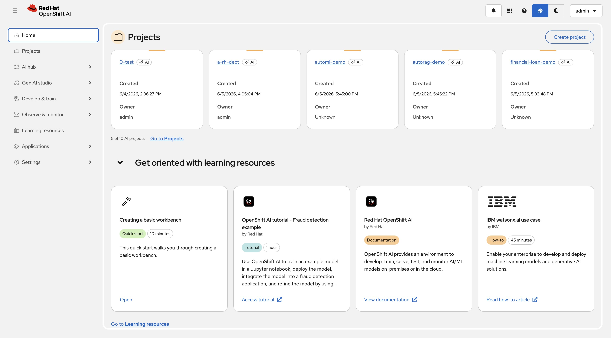

> Can't log in? Double-check your username and password with your instructor.

---

# Part 2: Create Your Project (5 min)

A "project" (also known as a Kubernetes namespace) is your workspace where you'll deploy models, create workbenches, and run experiments.

## Step 2.1: Create a New Project

1. Click **"Projects"** in the left sidebar

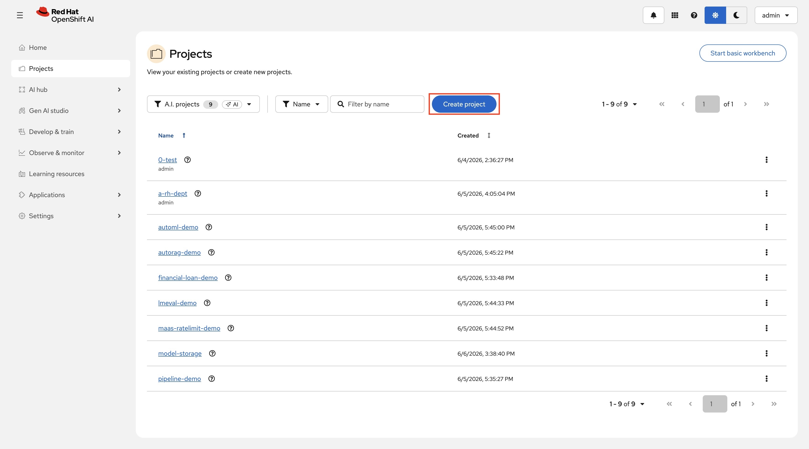

2. Click the **"Create project"** button (top right)
3. Fill in the form:

   | Field           | What to Enter                                         |
   | --------------- | ----------------------------------------------------- |
   | **Name**        | `user-XX` (use your assigned number, e.g., `user-05`) |
   | **Description** | `My workshop project` (optional)                      |

4. Click **"Create"**

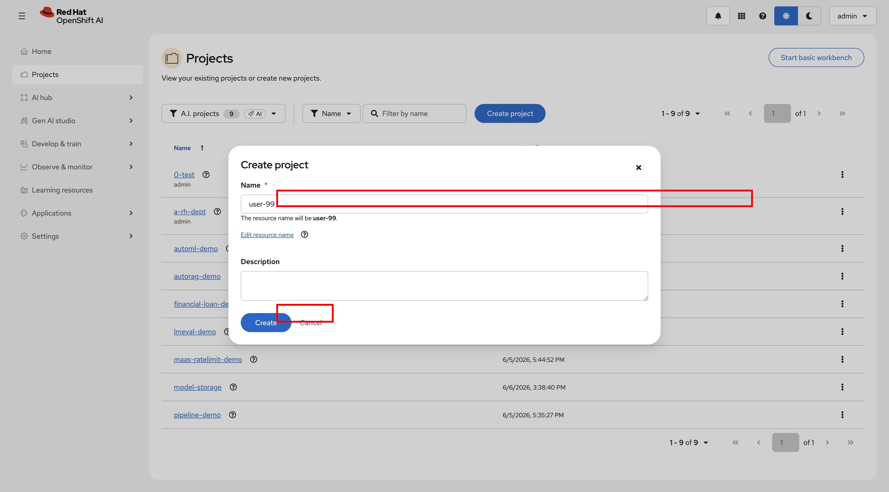

You should now see your project `user-XX` with tabs for **Overview**, **Workbenches**, **Pipelines**, **Deployments**, **Connections**, etc.

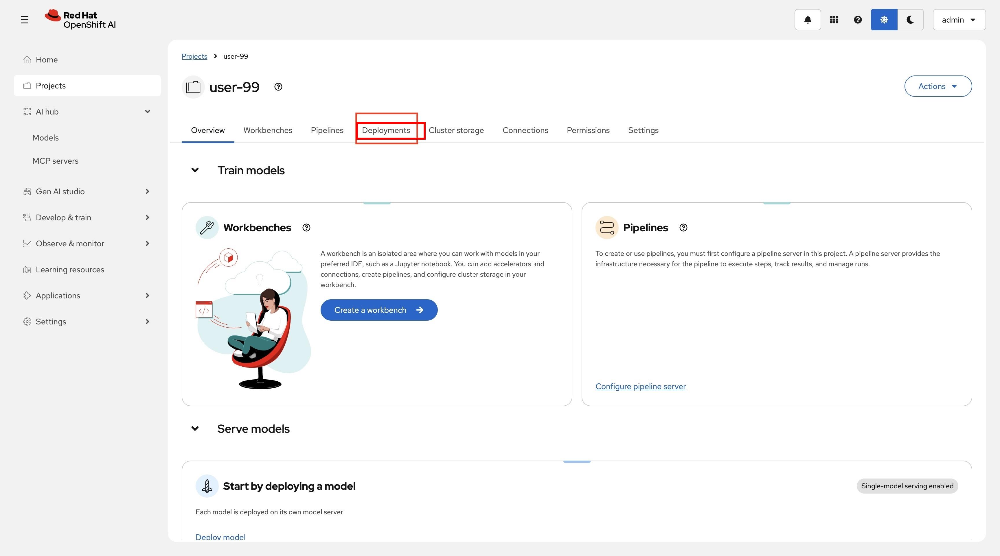

---

# Part 3: Deploy a Model (15 min)

In this section, you'll deploy the **Qwen3-4B** model using the **vLLM** serving runtime. The model is stored as an OCI (container) image, so no S3 storage credentials are needed.

## Step 3.1: Understanding Hardware Profiles (Instructor Demo)

> **This is a brief demo by your instructor** — you don't need to do anything, just watch and learn.

A **hardware profile** defines the compute resources (CPU, memory, GPU) allocated to a model deployment. It also includes tolerations that allow pods to schedule on GPU-tainted nodes.

**What the instructor will show:**

- Navigate to **Settings > Hardware profiles** in the RHOAI dashboard
- The pre-created `gpu-profile` that includes:
  - GPU resource limits (`nvidia.com/gpu`)
  - Node selector for GPU nodes (`nvidia.com/gpu.present: "true"`)
  - Tolerations for GPU node taints

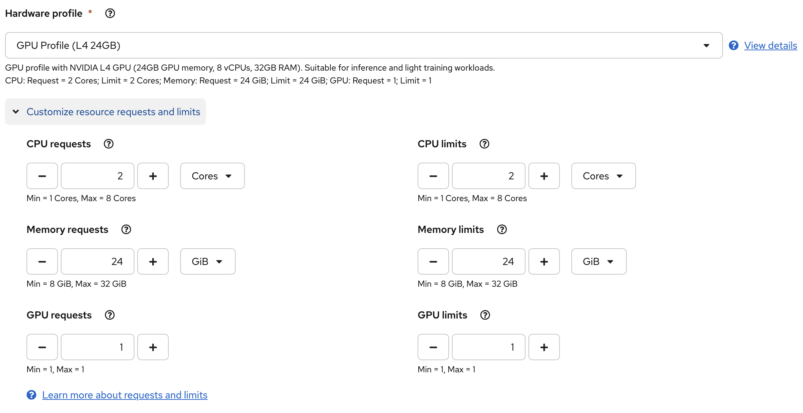

> **Important:** Only administrators can create or modify hardware profiles. As a workshop participant, you'll **select** the pre-created `gpu-profile` when deploying your model.

---

## Step 3.2: Start the Model Deployment

1. Click **"Projects"** in the left sidebar
2. Click on your project name (`user-XX`)
3. Click the **"Deployments"** tab
4. Click the **"Deploy model"** button

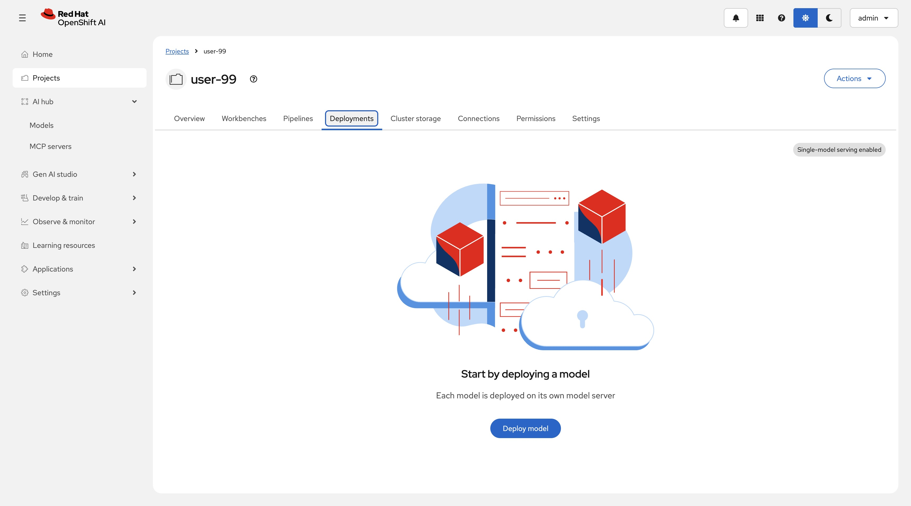

---

## Step 3.3: Wizard Step 1 — Model Details

The deployment wizard has 4 steps. The first step asks where the model is stored.

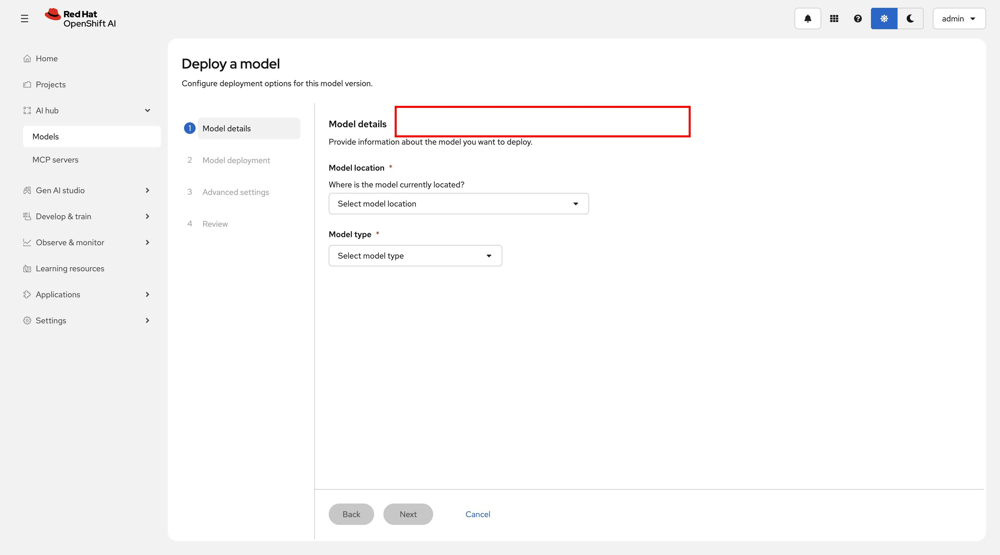

Fill in the following:

| Field              | What to Select/Enter                                          |
| ------------------ | ------------------------------------------------------------- |
| **Model location** | `URI`                                                         |
| **URI**            | `oci://quay.io/redhat-ai-services/modelcar-catalog:qwen3-4b` |
| **Name**           | `qwen3-4b`                         |
| **Model type**     | `Generative AI model (Example, LLM)`                         |

> **Tip:** Copy the URI exactly as shown. The name field will auto-populate. This pulls the model as an OCI container image — no storage credentials are required.

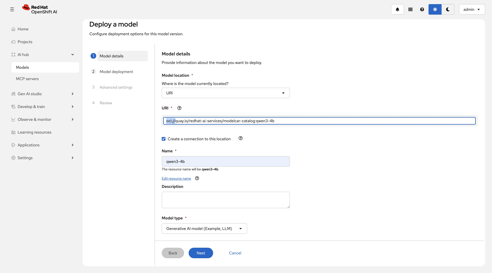

Click **"Next"** to proceed.

---

## Step 3.4: Wizard Step 2 — Model Deployment

Configure the deployment settings:

| Field                      | What to Select/Enter                        |
| -------------------------- | ------------------------------------------- |
| **Model deployment name**  | `qwen3-4b` (auto-populated)                |
| **Hardware profile**       | Select `GPU Profile (L4 24GB)` or your GPU profile |
| **Deployment resource**    | `Automatic selection` or `Manual selection` |
| **Number of replicas**     | `1`                                         |

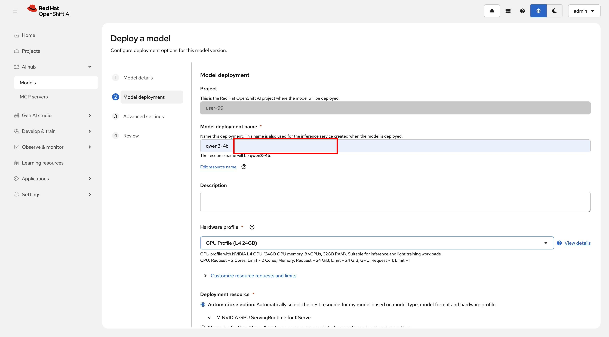

If you choose **Manual selection** for deployment resource, select **vLLM NVIDIA GPU ServingRuntime for KServe** from the dropdown:

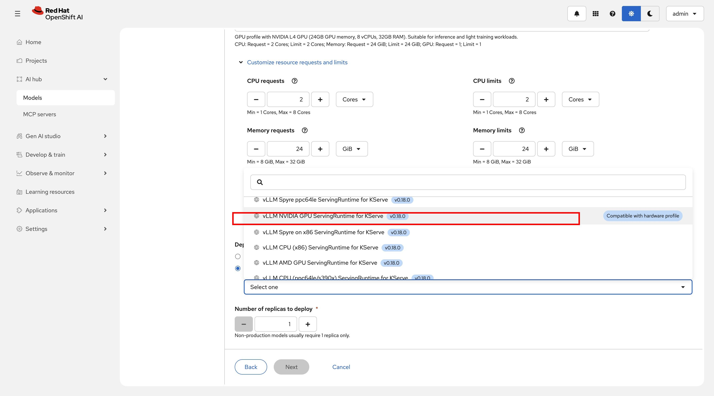

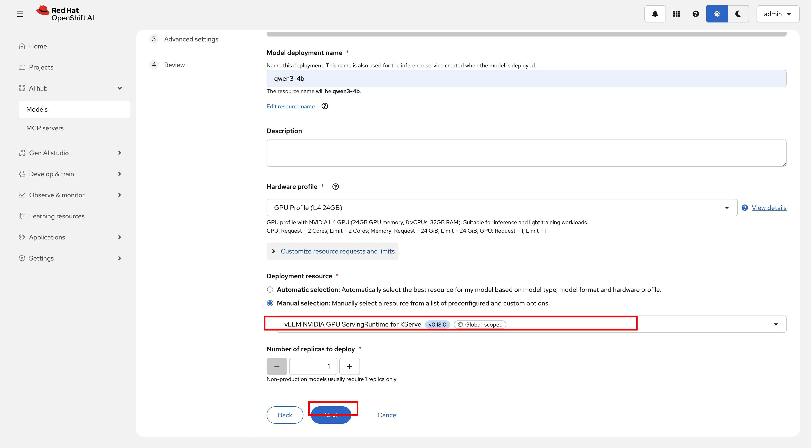

Click **"Next"** to proceed.

---

## Step 3.5: Wizard Step 3 — Advanced Settings

This step configures model availability and access. **You must check "Publish as AI asset endpoint"** to use the AI Playground later.

| Setting                           | What to Do                        |
| --------------------------------- | --------------------------------- |
| **Publish as AI asset endpoint**  | **Check this box** (required for Playground) |
| **Make model deployment available through an external route** | Leave unchecked (optional) |
| **Require token authentication**  | Leave unchecked (optional) |
| **Add custom runtime arguments**  | Leave unchecked (for now) |

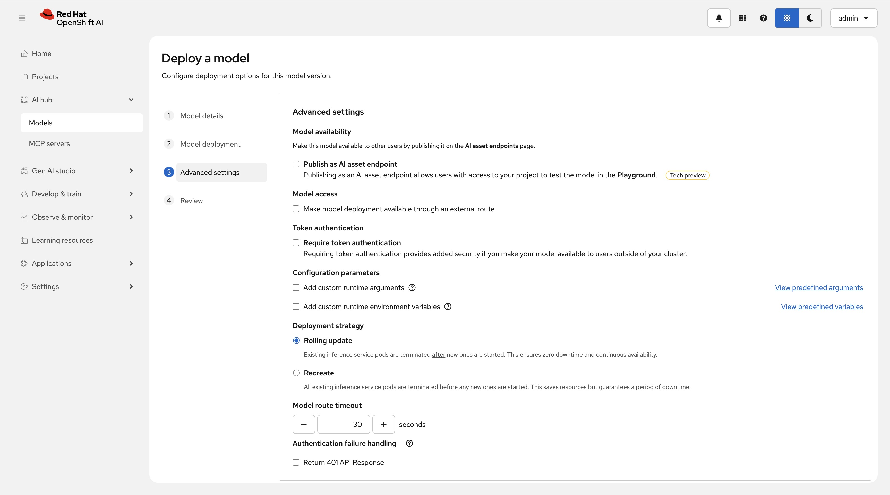

> **Important:** If you skip checking "Publish as AI asset endpoint", your model will not appear in the Playground.

Click **"Next"** to proceed.

---

## Step 3.6: Wizard Step 4 — Review and Deploy

Review the configuration summary. Verify the key settings:

- **Model location:** URI
- **Location details:** `oci://quay.io/redhat-ai-services/modelcar-catalog:qwen3-4b`
- **Hardware profile:** gpu-profile
- **Deployment resource:** vLLM NVIDIA GPU ServingRuntime for KServe
- **Replicas:** 1
- **AI asset endpoint:** Yes

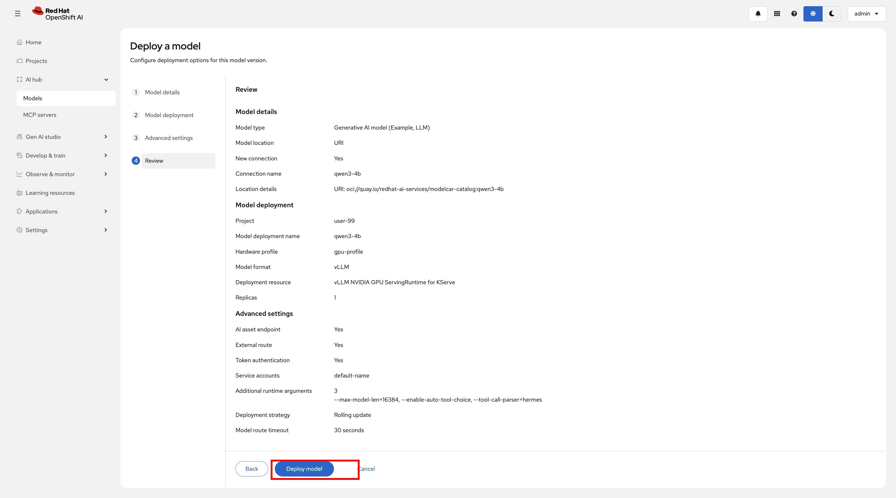

Click **"Deploy model"** to start the deployment.

---

# Part 4: Wait for Model & Monitor (10 min)

The model needs a few minutes to pull the container image and start the vLLM server.

## Step 4.1: Monitor Deployment Status

1. After clicking Deploy, you'll be taken to the Deployments tab
2. Watch the status indicator next to `qwen3-4b`:

| Status       | What It Means                                        |
| ------------ | ---------------------------------------------------- |
| **Starting** | Container image is being pulled and model is loading |
| **Ready**    | Model is ready to serve requests                     |
| **Failed**   | Something went wrong (check events)                  |

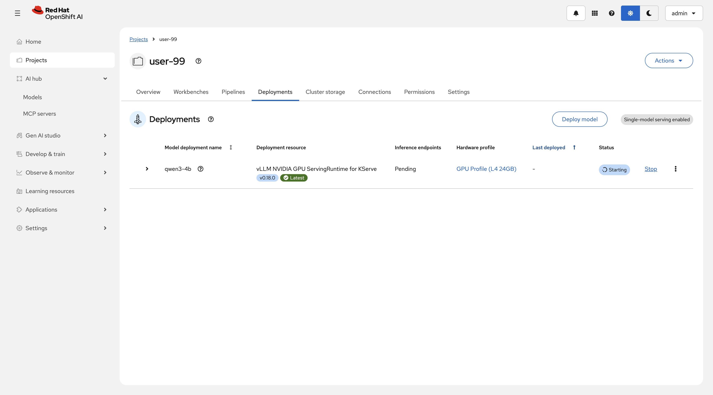

> This typically takes **3–5 minutes** depending on image cache state and GPU availability. Feel free to stretch!

## Step 4.2: Verify the Model is Running

Once the status shows **Ready** (green), your model is ready.

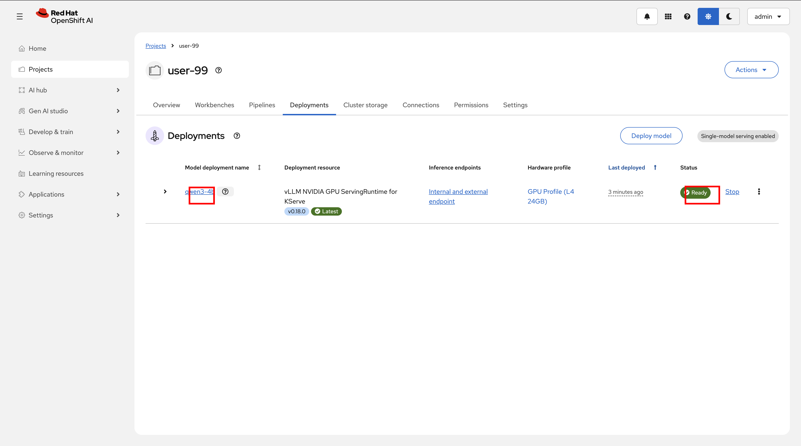

1. You should see the model listed under Deployments with a green **Ready** status
2. Click the expand arrow next to the model name to see details including:
   - Inference endpoints (internal and external)
   - Framework, replicas, hardware profile
   - Token authentication details (if enabled)

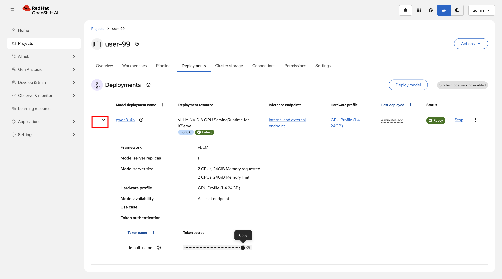

---

# Part 5: Test with AI Playground (15 min)

The **AI Playground** provides a chat interface to interact with your deployed model directly from the dashboard — no code required.

## Step 5.1: Verify AI Asset Endpoint

Since you checked **"Publish as AI asset endpoint"** during deployment (Step 3.5), your model should already be registered.

1. Click **"Gen AI studio"** in the left sidebar to expand it
2. Click **"AI asset endpoints"**
3. Make sure your project (`user-XX`) is selected in the **Project** dropdown
4. You should see `qwen3-4b` listed with a **Ready** status

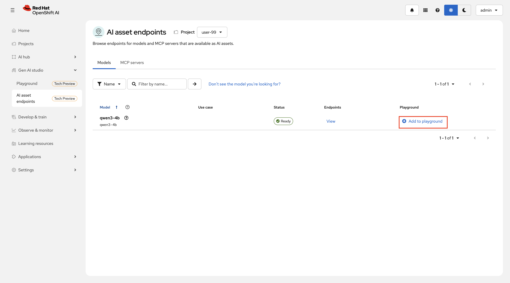

---

## Step 5.2: Create the Playground

1. On the AI asset endpoints page, click **"Add to playground"** next to your model
2. In the **"Configure playground"** dialog, make sure `qwen3-4b` is checked
3. Click **"Create"**

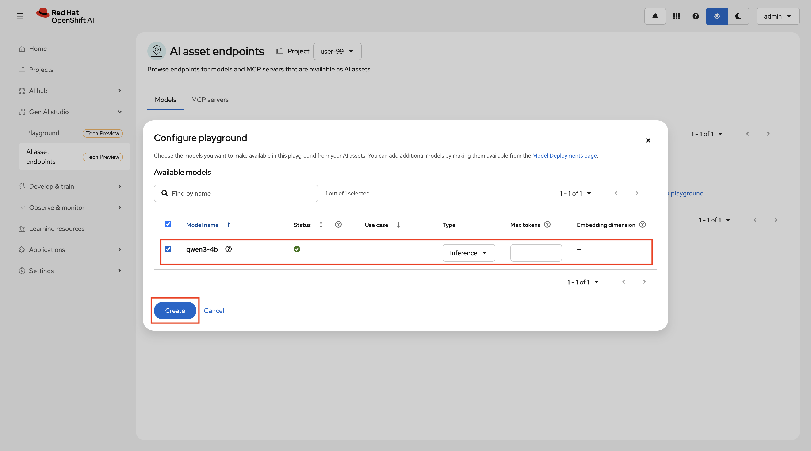

---

## Step 5.3: Open the Playground

1. Click **"Gen AI studio"** > **"Playground"** in the left sidebar
2. You should see the Playground interface with your model selected

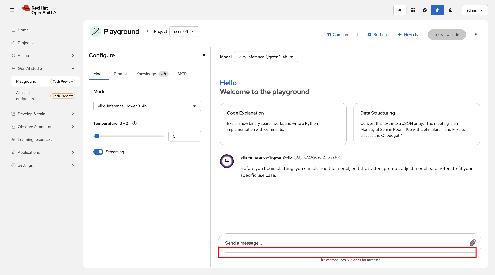

---

## Step 5.4: Chat with Your Model

Type a message in the chat box and press Enter (or click the send button).

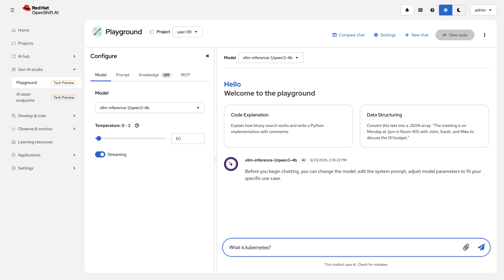

Try these prompts to verify your model is working:

```
What is Kubernetes?
```

```
Write a haiku about cloud computing.
```

```
Explain the difference between machine learning and deep learning in simple terms.
```

```
Write a Python function that calculates the Fibonacci sequence up to n terms.
```

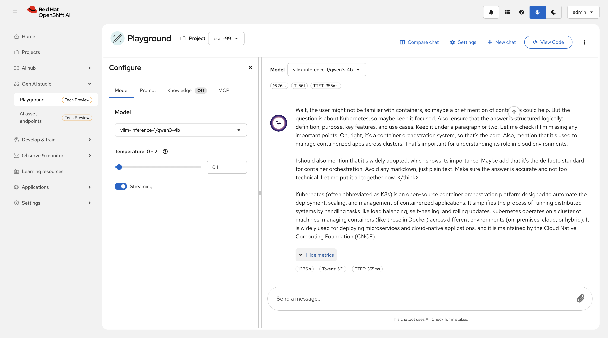

Your AI model is working! You can continue chatting with it about any topic.

---

## Step 5.5: Explore Playground Settings

The Playground offers several configuration options to tune model behavior:


| Setting           | What It Does                                          | Suggested Value     |
| ----------------- | ----------------------------------------------------- | ------------------- |
| **Temperature**   | Controls randomness (0 = deterministic, 1 = creative) | 0.7                 |
| **Max tokens**    | Maximum length of the response                        | 256–1024            |
| **Top P**         | Nucleus sampling threshold                            | 0.9                 |
| **System prompt** | Sets the model's persona/instructions                 | (try a custom one!) |


### Try a system prompt

In the system prompt field (if available), enter:

```
You are a helpful assistant that explains technical concepts using simple analogies. Always include a real-world analogy in your answers.
```

Then ask:

```
What is Kubernetes?
```

Notice how the response now includes an analogy!

The Playground's **Configure** panel on the left side lets you adjust the Temperature slider and toggle Streaming. Click the **Prompt** tab to set a system prompt.

---

# Appendix: Good to Know

These are optional topics for further exploration after the workshop.

---

## Tool Calling

Tool calling allows the model to invoke external tools (APIs, databases, etc.) to answer questions with live data. To enable it, add **custom runtime arguments** during model deployment in the **Advanced settings** step (Step 3 of the wizard):

1. Check **"Add custom runtime arguments"**
2. Add the following arguments (each on its own line):

   ```
   --enable-auto-tool-choice
   --tool-call-parser=hermes
   ```

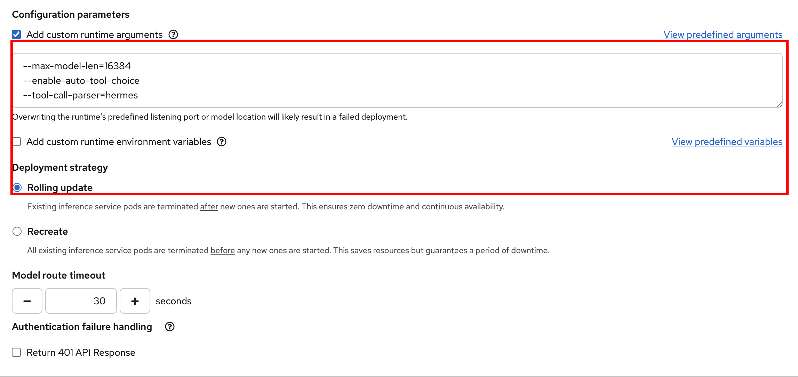

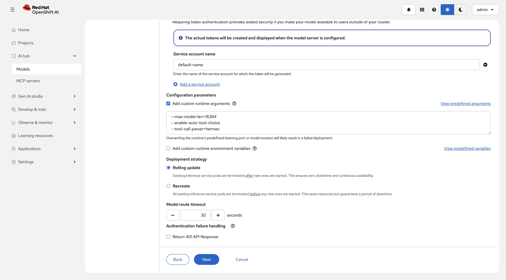

| Argument                    | Purpose                                            |
| --------------------------- | -------------------------------------------------- |
| `--enable-auto-tool-choice` | Allows the model to decide when to use tools       |
| `--tool-call-parser=hermes` | Tells vLLM how to parse Qwen's tool call output    |

Different model families require different tool call parsers:

| Model Family | Parser        |
| ------------ | ------------- |
| Llama        | `llama3_json` |
| Qwen         | `hermes`      |
| Mistral      | `mistral`     |

---

## Model Catalog

RHOAI 3.4 includes a **Model Catalog** with pre-validated model configurations:

1. Click **"Model catalog"** in the left sidebar
2. Browse available models (Granite, Llama, Qwen, Mistral, etc.)
3. Click on a model to see details, recommended hardware, and deployment instructions
4. Click **"Deploy"** to start a pre-configured deployment

---

# Congratulations!

You've completed the Model Deployment Workshop!

## What You Accomplished


| Task                                       | Status |
| ------------------------------------------ | ------ |
| Logged into OpenShift AI                   | Done   |
| Created a Data Science project             | Done   |
| Deployed a model with vLLM runtime         | Done   |
| Monitored deployment status                | Done   |
| Tested the model via the AI Playground     | Done   |


## What's Next?

After this workshop, you can explore:


| Topic                          | Where to Learn More                                                                                                                         |
| ------------------------------ | ------------------------------------------------------------------------------------------------------------------------------------------- |
| **MCP Tools**                  | Connect external tools (Weather, HR, etc.) to extend your model's capabilities. See [MCP Server Setup](MCP-SERVER-SETUP.md)                 |
| **Models-as-a-Service (MaaS)** | API keys, subscriptions, and rate limiting for multi-tenant model access. See [MaaS Policy Enforcement](MAAS-POLICY-ENFORCEMENT.md)         |
| **NeMo Guardrails**            | Add safety guardrails to your model responses. See [RHCL + Guardrails Architecture](RHCL-GUARDRAILS-ARCHITECTURE.md)                        |
| **Model Registry**             | Version and manage your models. See [Model Registry](MODEL-REGISTRY.md)                                                                     |
| **AI Pipelines**               | Build automated ML workflows. See the [RHOAI documentation](https://docs.redhat.com/en/documentation/red_hat_openshift_ai_self-managed/3.4) |
| **LLM Evaluation**             | Benchmark your models with LMEval. See the [Demo Environment](DEMO-ENVIRONMENT.md)                                                          |


---

# Troubleshooting

## "Model stuck on Pending"

**Cause:** No GPU nodes available, or GPU is occupied by another deployment.

**Fix:**

- Check if GPU nodes exist: look for nodes labeled with `nvidia.com/gpu.present=true`
- Ask your instructor if GPUs are available

## "Model shows Failed status"

**Cause:** Various — could be image pull error, insufficient resources, or configuration issue.

**Fix:**

1. Click on the model name to see deployment details
2. Check the **Events** tab for error messages
3. Common issues:
  - Image pull errors: verify the OCI URI is correct
  - Insufficient GPU memory: the model may need more than available VRAM
  - Missing hardware profile: ensure `gpu-profile` exists

## "Playground not loading or no models available"

**Cause:** Model is not registered as an AI asset, or model is not fully ready.

**Fix:**

1. Verify your model shows **Available** status in the Deployments tab
2. Ensure the model is registered as an AI asset endpoint
3. Try refreshing the browser page
4. Wait 1–2 minutes after the model becomes Available

## Still stuck?

Raise your hand! The instructors are here to help.

---

# Quick Reference Card

## Your Info

- **Username:** `_______`_
- **Password:** `________`
- **Project name:** `user-____`

## Key URLs


| Resource        | URL                                   |
| --------------- | ------------------------------------- |
| RHOAI Dashboard | `https://rh-ai.apps.<cluster-domain>` |


## Key Terminal Commands

```bash
# Check your login
oc whoami

# Switch to your project
oc project user-XX

# Check model pods
oc get pods -n user-XX

# Check model status
oc get inferenceservice -n user-XX

# Check GPU availability
oc get nodes -l nvidia.com/gpu.present=true

# View model logs (if troubleshooting)
oc logs -n user-XX -l serving.kserve.io/inferenceservice=qwen3-4b --tail=50

# Delete your project (cleanup)
oc delete project user-XX
```

---

# Appendix: Instructor Setup Checklist

This section is for workshop instructors setting up the environment.

## Pre-workshop Setup

1. **Install RHOAI 3.4** using the automated script (no RHCL/MaaS needed):

   ```bash
   ./scripts/install-rhoai-34.sh --skip-rhcl --skip-maas --setup-users --num-users <N> --user-password <password>
   ```

   This installs RHOAI with direct model serving (Path A). Users will deploy models via the standard `InferenceService` path in the dashboard.

2. **Verify GPU nodes** are available:

   ```bash
   oc get nodes -l nvidia.com/gpu.present=true
   ```

3. **Verify hardware profile** exists:

   ```bash
   oc get hardwareprofile gpu-profile -n redhat-ods-applications
   ```

   If missing, create it:

   ```bash
   oc apply -f lib/manifests/rhoai/hardware-profile-gpu.yaml
   ```

4. **Verify dashboard features** are enabled:

   ```bash
   oc get odhdashboardconfig odh-dashboard-config -n redhat-ods-applications \
     -o jsonpath='{.spec.dashboardConfig}' | jq '{disableModelCatalog, genAiStudio}'
   ```

5. **Test a model deployment** yourself before the workshop to ensure images are cached on nodes.

6. **Review the guide images** in the `images/` directory to ensure they match your cluster's UI version.

## Workshop Credentials Template

Provide each participant with:


| Field                     | Value                                 |
| ------------------------- | ------------------------------------- |
| OpenShift AI Dashboard URL | `https://rh-ai.apps.<cluster-domain>` |
| Login provider            | `htpasswd` or `workshop-users`        |
| Username                  | `userXX`                              |
| Password                  | (your chosen password)                |
| User number (for project) | `XX`                                  |


---

**Reference:** [RHOAI 3.4 Documentation](https://docs.redhat.com/en/documentation/red_hat_openshift_ai_self-managed/3.4)
